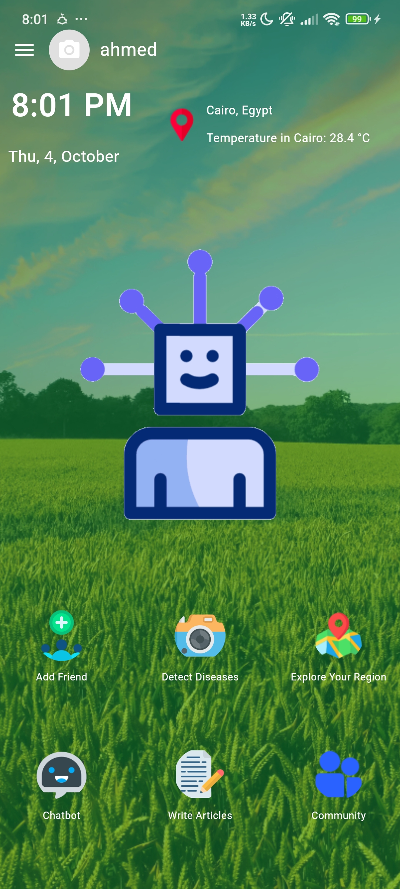
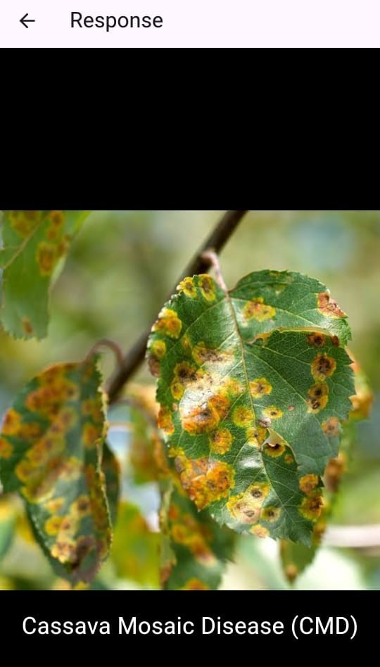
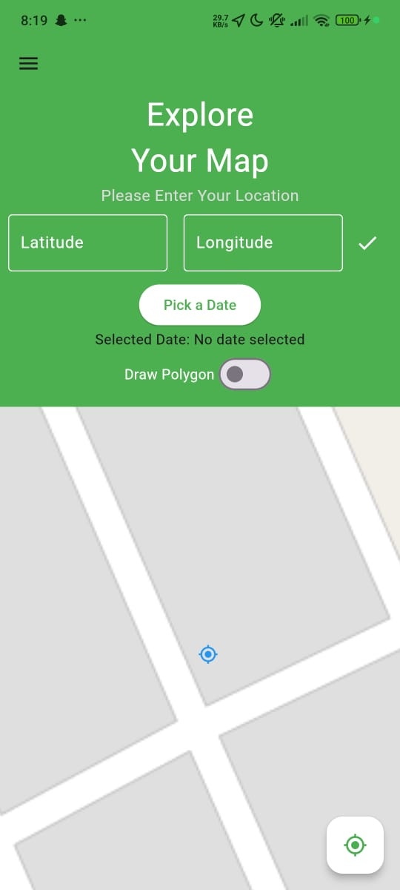

# Agri-nauts: Leveraging Earth Observation Data for Informed Agricultural Decision-Making

Welcome to the Agri-nauts project repository for NASA Space Apps 2024! Our team has developed an innovative mobile application that combines artificial intelligence and satellite data to revolutionize agricultural decision-making.


## Project Overview

Farmers worldwide face numerous water-related challenges due to unpredictable weather patterns, including droughts, floods, and soil moisture issues. These problems significantly impact crop health, farmer profits, and global food security. Our solution, the Agri-nauts app, addresses these challenges by leveraging Earth observation data and AI to provide informed agricultural decision-making tools.

## Key Features

1. **Weather and Environmental Predictions**
   - Soil moisture forecasting
   - Drought stage predictions
   - Air quality forecasts
   - Flood prediction model

2. **Plant Disease Detection**
   - Uses computer vision with 92% accuracy
   - Identifies plant diseases through smartphone camera
   - Suggests appropriate treatments

3. **AI-Powered Chatbot**
   - Provides quick solutions to common agricultural problems

4. **Community Hub**
   - Allows users to share experiences and problems
   - Features a Scientific Lab section with latest research and agricultural solutions

5. **Integrated Marketplace**
   - Enables users to buy and sell agricultural products, including fertilizers, pesticides, and equipment

## Technology Stack

- **Mobile App Development**: Flutter (Dart)
- **Backend**: Not specified (Please add details)
- **ML/Data**: Machine Learning, Deep Learning algorithms (RNN-LSTM), Computer Vision
  
## Data Source

## Prerequisites

To ensure that the code runs smoothly, the following Python libraries and packages should be installed. Below is a list of required libraries along with instructions on how to install them.

## Required Libraries

1. **time** - A built-in Python library for time-related functions.
2. **pickle** - A built-in Python library for serializing and deserializing Python objects.
3. **numpy** - A fundamental package for scientific computing with Python.
4. **pandas** - A library for data manipulation and analysis.
5. **matplotlib** - A plotting library for creating static, animated, and interactive visualizations.
6. **seaborn** - A Python data visualization library based on `matplotlib`.
7. **plotly.express** - A high-level interface to Plotly for creating figures.
8. **statsmodels** - A module that provides tools for estimating and testing statistical models.
   - `arima` - For ARIMA modeling.
   - `seasonal_decompose` - For time series decomposition.
   - `plot_acf`, `plot_pacf` - For autocorrelation and partial autocorrelation plots.
9. **sklearn (scikit-learn)** - A machine learning library for Python, especially for metrics like `mean_squared_error` and `mean_absolute_error`.
10. **cv2 (OpenCV)** - An open-source computer vision library.

### Installation

You can install these libraries using `pip`. Run the following commands in your terminal or command prompt:

```bash
pip install numpy pandas matplotlib seaborn plotly statsmodels scikit-learn opencv-python
```


## App Screenshots

<table>
  <tr>
    <td></td>
    <td></td>
  </tr>
  <tr>
    <td>Home Screen</td>
    <td>Add Friend</td>
  </tr>
  <tr>
    <td></td>
    <td></td>
  </tr>
  <tr>
    <td>Chat Bot</td>
    <td>Plant Disease Detection</td>
  </tr>
  <tr>
    <td></td>
    <td></td>
  </tr>
  <tr>
    <td>Explore The Map</td>
    <td></td>
  </tr>
</table>

## Future Enhancements

- Integration of additional data sources
- Improvement of AI models for more accurate predictions
- Expansion of plant disease detection capabilities
- User interface enhancements based on farmer feedback

## Our Team

Our diverse team consists of 6 talented individuals. For more information about our team, please see our [Team Members](our_team.md) page.

## Acknowledgments

- NASA Space Apps Challenge for the opportunity
- NASA EARTH DATA for providing crucial Earth observation data

## Feedback and Support

We value your feedback! If you have any questions, suggestions, or encounter any issues while using the Agri-nauts application, please don't hesitate to reach out to us [Team Members](our_team.md). Your input is crucial in helping us improve the app and provide a better experience for farmers and agricultural professionals worldwide.

Thank you for joining us on this important mission to leverage space technology for sustainable agriculture and global food security. Together, we can make a real difference in how we manage our planet's precious resources!
